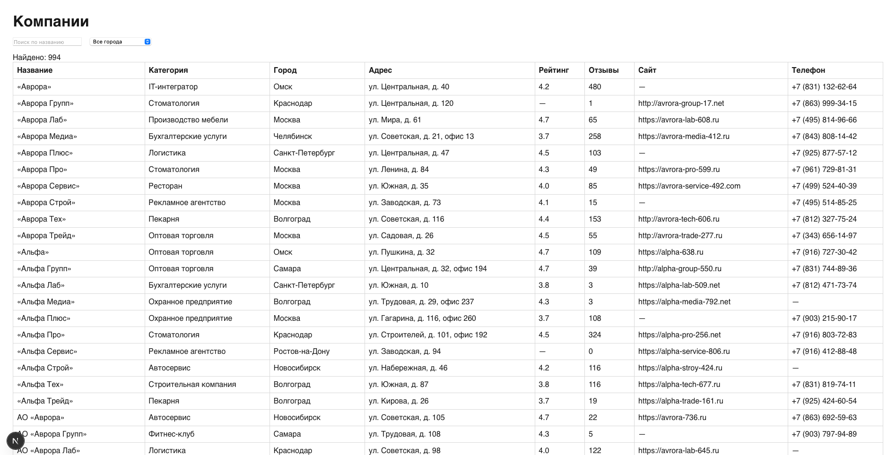
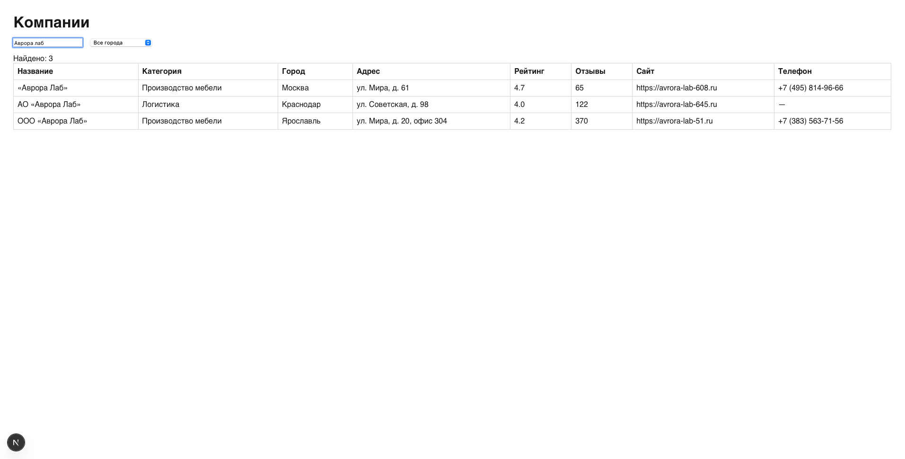
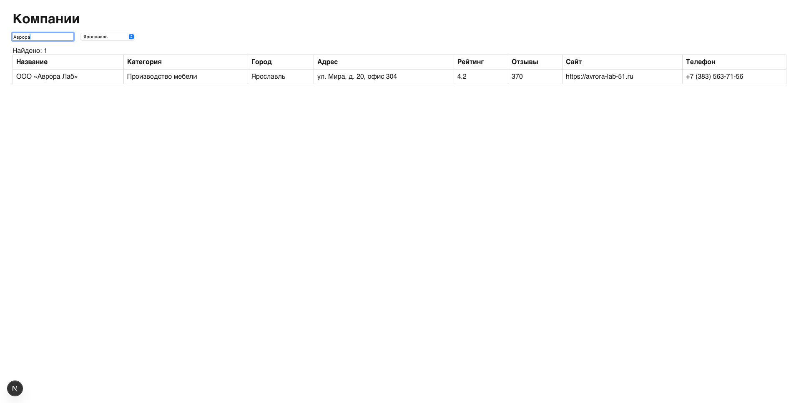
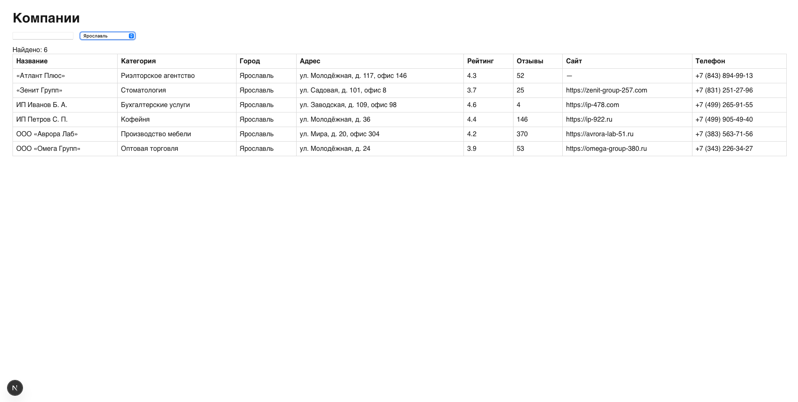
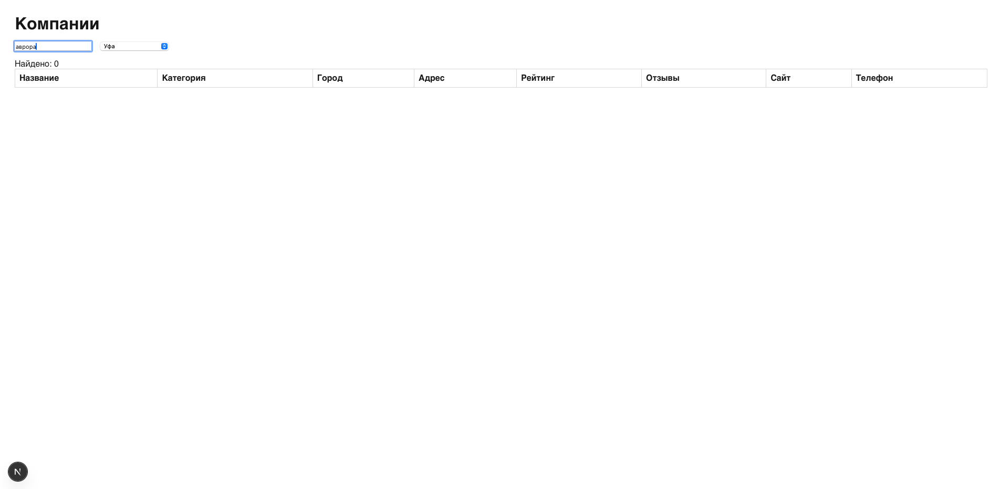

# Доказательство работы: /companies

Страница `/companies` (Next.js App Router, Server Component + Postgres) — поиск по названию и фильтр по городу.

## Скриншоты

**Без фильтров — вся база (994 компании):**

**Поиск по названию («Аврора лаб») — 3 совпадения:**

**Поиск + фильтр по городу («Аврора» + Ярославль) — 1 совпадение:**

**Только фильтр по городу (Ярославль) — 6 компаний:**

**Пустой результат («аврора» + Уфа) — совпадений нет:**

## Как проверяла

1. Открыла `/companies` без фильтров — отрендерилась вся таблица, «Найдено: 994», это совпадает с числом строк в базе после дедупликации.
2. Ввела в поиск «Аврора лаб» — осталось 3 записи; поиск регистронезависимый (`ILIKE`), вводила с маленькой буквы — совпадения с «Аврора Лаб» нашлись.
3. Проверила фильтры по отдельности и вместе: только город Ярославль — 6 компаний; «Аврора» + Ярославль — 1 запись. То есть фильтры комбинируются через AND, а не перезаписывают друг друга.
4. Проверила пустой результат на реальной комбинации: «аврора» + Уфа — «Найдено: 0», пустая таблица, страница не падает.
5. **Нашла и починила гонку состояний.** Если поменять город, не дождавшись debounce (300 мс) после ввода текста, один фильтр молча затирал другой: обработчик `select` брал устаревшее значение поиска из пропсов, а отложенный таймер потом навигировал со своим устаревшим городом. Воспроизвела скриптом в консоли — ввод «Аврора» + выбор «Ярославль» давал `?q=Аврора` вместо `?q=Аврора&city=Ярославль`, то есть 30 компаний вместо 1. Исправила: форма читает актуальные значения обоих полей из DOM в момент навигации, а не из захваченных в замыкании пропсов. После фикса та же проверка даёт `?q=Аврора&city=Ярославль` и 1 запись — в обоих порядках действий.
6. Во время правок dev-сервер Turbopack залип в цикле пересборки на каждый запрос (в логах `CJS module can't be async`, потом `ChunkLoadError`) — страница открывалась, но каждый запрос стал занимать 3+ секунды. Помогла очистка `.next` и перезапуск сервера.
7. Попутно нашла косяк в тексте: было «994 результатов» — некорректное склонение для любых чисел, кроме 2–4. Заменила на «Найдено: N», чтобы не тащить логику склонений ради одной строки.
